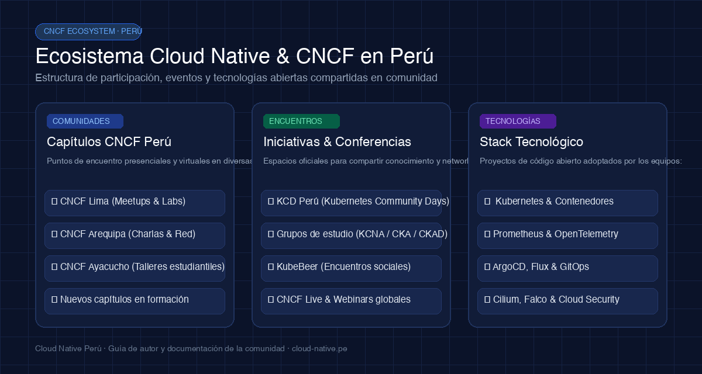

¡Te damos la bienvenida al blog oficial de **Cloud Native Perú**! Este es un espacio comunitario abierto y colaborativo pensado para compartir conocimientos, tutoriales técnicos, lecciones aprendidas en producción y experiencias con proyectos de la **Cloud Native Computing Foundation (CNCF)**.

No necesitas ser un experto con décadas de experiencia para escribir aquí. Un problema que solucionaste en tu cluster, un laboratorio que probaste el fin de semana o una explicación amigable sobre contenedores pueden ser exactamente lo que otra persona en la comunidad necesita.

> **💡 Propósito de esta guía:** Este artículo sirve como ejemplo vivo y manual de estilo. A continuación encontrarás todos los formatos y elementos visuales soportados para que prepares tu publicación con la mejor calidad técnica y visual.

---

## 1. Comandos de terminal y salida de consola

Para tutoriales y guías prácticas, los comandos de terminal son esenciales. Puedes utilizar bloques de código formateados con `bash` o `shell` para destacar comandos, argumentos y parámetros.

### Inspección de recursos con kubectl

```bash
# Verificar la conexión al cluster y listar los nodos disponibles
$ kubectl get nodes -o wide

NAME                                      STATUS   ROLES    AGE   VERSION   INTERNAL-IP
ip-10-0-1-42.sa-east-1.compute.internal   Ready    control  42d   v1.31.1   10.0.1.42
ip-10-0-2-18.sa-east-1.compute.internal   Ready    worker   42d   v1.31.1   10.0.2.18
ip-10-0-2-99.sa-east-1.compute.internal   Ready    worker   42d   v1.31.1   10.0.2.99

# Desplegar un pod de prueba en el namespace default
$ kubectl run cloud-native-demo --image=nginx:alpine --port=80
pod/cloud-native-demo created
```

### Ejecución de contenedores con Docker

```bash
# Descargar y levantar un contenedor local de prueba
$ docker run -d --name cn-app -p 8080:80 nginx:alpine
d8f1e4b9c2a3e5f6a7b8c9d0e1f2a3b4c5d6e7f8a9b0c1d2e3f4a5b6c7d8e9f0

# Inspeccionar logs en tiempo real
$ docker logs -f cn-app
2026/10/02 [notice] 1#1: using the "epoll" event method
2026/10/02 [notice] 1#1: nginx/1.27.2
2026/10/02 [notice] 1#1: start worker processes
```

---

## 2. Manifiestos de infraestructura y código fuente

El blog soporta sintaxis limpia para formatos declarativos como **YAML**, **JSON**, **Go**, **Python** y **TypeScript**.

### Manifiesto de Kubernetes (Deployment & Service)

```yaml
apiVersion: apps/v1
kind: Deployment
metadata:
  name: cloud-native-api
  namespace: produccion
  labels:
    app.kubernetes.io/name: cloud-native-api
    app.kubernetes.io/part-of: cn-peru
spec:
  replicas: 3
  selector:
    matchLabels:
      app: cloud-native-api
  template:
    metadata:
      labels:
        app: cloud-native-api
    spec:
      containers:
        - name: api
          image: ghcr.io/cloudnativelima/api:v1.2.0
          ports:
            - containerPort: 8080
          resources:
            requests:
              cpu: 100m
              memory: 128Mi
            limits:
              cpu: 500m
              memory: 512Mi
          livenessProbe:
            httpGet:
              path: /healthz
              port: 8080
            initialDelaySeconds: 15
```

---

## 3. Bloques de notas, consejos y advertencias

Para resaltar ideas importantes o precauciones en producción, utiliza citas `>` con prefijos destacados:

> **💡 Consejo para autores:** Mantén tus explicaciones orientadas a la práctica. Si explicas un concepto teórico como *eBPF* o *Service Mesh*, incluye siempre un ejemplo reproducible o diagrama que ayude a visualizarlo.

> **⚠️ Atención en producción:** Nunca almacenes credenciales, tokens de acceso o llaves privadas en tus manifiestos de Kubernetes o en el repositorio público. Utiliza siempre herramientas como External Secrets Operator o Sealed Secrets.

---

## 4. Imágenes, diagramas de arquitectura y figuras

Un buen diagrama de arquitectura vale más que mil líneas de código. Las imágenes deben guardarse dentro de la carpeta `imagenes/` de tu artículo.



Para incrustar una imagen local con pie explicativo:
1. Coloca tu archivo en `articulos/tu-articulo/imagenes/diagrama.png`.
2. Enlázala en Markdown como ``.
3. El sistema optimizará y publicará la imagen de forma segura sin requerir hosting externo.

---

## 5. Tablas comparativas

Las tablas en Markdown son ideales para comparar proyectos, herramientas o métricas de rendimiento.

| Proyecto CNCF | Categoría | Nivel de Madurez | Caso de Uso Principal |
| :--- | :--- | :--- | :--- |
| **Kubernetes** | Orquestación | Graduated | Gestión automatizada de clusters y contenedores |
| **Prometheus** | Monitoreo | Graduated | Métricas en tiempo real y alertas de sistemas |
| **OpenTelemetry** | Observabilidad | Incubating | Estándar unificado para traces, metrics y logs |
| **Argo CD** | GitOps / CI-CD | Graduated | Entrega continua declarativa en Kubernetes |
| **Cilium** | Redes & Seguridad | Graduated | Conectividad y observabilidad basada en eBPF |

---

## 6. Lista de verificación antes de publicar

Antes de enviar tu artículo a revisión mediante un Pull Request, valida los siguientes puntos:

- [x] El artículo está guardado en `articulos/tu-articulo/index.md`.
- [x] El archivo incluye el frontmatter inicial (`title`, `description`, `author`, `date`, `status: published`, `tags`).
- [x] Los encabezados inician desde `##` (el `h1` se genera automáticamente a partir del título).
- [x] Todos los comandos y fragmentos de código están probados y funcionan.
- [x] Las imágenes están ubicadas dentro de `imagenes/` en formatos `.png`, `.jpg` o `.webp`.
- [x] Los enlaces externos apuntan a documentación oficial o fuentes citadas.

---

## 7. Cómo enviar tu artículo paso a paso

Publicar en el blog es tan sencillo como abrir un Pull Request en GitHub:

```bash
# 1. Clona el repositorio oficial del blog
$ git clone https://github.com/cloudnativelima/blog.git
$ cd blog

# 2. Crea una rama para tu publicación
$ git checkout -b articulo/mi-guia-cloud-native

# 3. Crea la carpeta de tu artículo usando la plantilla
$ cp -r plantillas/articulo articulos/mi-guia-cloud-native

# 4. Edita articulos/mi-guia-cloud-native/index.md con tu editor favorito
# 5. Ejecuta las pruebas locales para verificar el formato
$ npm test

# 6. Sube los cambios y abre el Pull Request en GitHub
$ git add articulos/mi-guia-cloud-native
$ git commit -m "Publicar: Mi guía técnica sobre Cloud Native"
$ git push origin articulo/mi-guia-cloud-native
```

Una vez creado el PR, el equipo de la comunidad revisará la propuesta, brindará feedback amigable y se encargará del despliegue automático a producción.

---

## ¡Tu experiencia importa!

La comunidad de Cloud Native en Perú crece cuando compartimos lo que aprendemos en el camino. Ya sea tu primer artículo técnico o una guía avanzada de arquitectura, este espacio está abierto para ti.

¿Tienes dudas o quieres conversar sobre una idea antes de escribir? Escríbenos a [contacto@cloud-native.pe](mailto:contacto@cloud-native.pe) o únete a nuestros encuentros de la comunidad.
